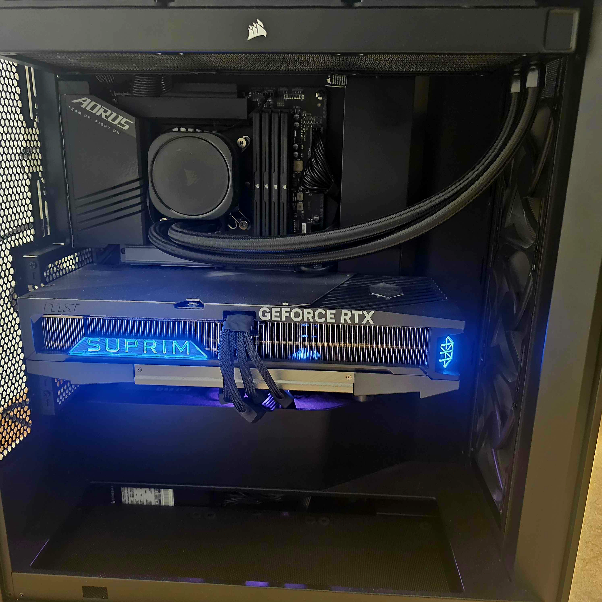

# Hi, I'm Iwan  
**Detailhandelsfachmann / IT-Hardware-Support @ Interdiscount**  
Currently transitioning toward IT Support and Cybersecurity in the near future.
---

**Tech:** Windows | PowerShell | Linux | BIOS/UEFI | Hardware Repair | Networking

---

##  About Me
- Hands-on hardware troubleshooting, BIOS, and Windows deployments  
- Interested in IT Support, Systems, and Automation  
- Building a portfolio of real-world troubleshooting case studies  

 **Contact:** [iwan.statnic@outlook.com](mailto:iwan.statnic@outlook.com)  
 **GitHub:** d0t_dotnet@proton.me  

---

##  Projects

### 🖥️ IT Support Case Studies
Documentation and analysis of real-world support cases:  
- Windows 11 Driver Troubleshooting  
- BIOS/UEFI Update  
- Linux/Windows Dual-Boot Setup  
- Password Reset via REGEDIT  
→ View studies at files section.

---

### ⚙️ Personal Projects
- **System Tools** – Batch and PowerShell utilities
- **2 PC System Builds** - completed with success. 

## 🖥️ Custom High-Performance Workstation Build

**Purpose:** Designed a stable, thermally optimized workstation for gaming, virtualization, and AI workloads.  
**Focus:** Cable management, BIOS optimization, and long-term system reliability.

**Specs:**
- **CPU:** Intel Core i7-13700K  
- **GPU:** MSI RTX 5090 SUPRIM X  
- **Motherboard:** Z790 AORUS ELITE AX  
- **RAM:** 64 GB DDR5 Corsair Vengeance  
- **Storage:** Corsair MP600 4 TB NVMe  
- **Cooling:** Corsair Nautilus 360mm
- **Case:** NZXT H7 FLOW 
- **PSU:** Corsair PSU RMe 1200W 80+Gold

**Highlights:**
- Tuned fan curves and BIOS for optimal thermals under heavy load.  
- Achieved sub-70 °C temps during sustained 4.8 GHz CPU workloads.  
- Near-silent idle operation and efficient cable routing.

# Iwan Statnic – IT Support Case Studies & Technical Documentation

**Detailhandelsfachmann | PC-Spezialist @ Interdiscount Zürich Airport**  
Motivierter Quereinsteiger mit praktischer Erfahrung in Hardware- und Software-Troubleshooting.

### Über dieses Repository
Hier dokumentiere ich **reale IT-Support-Fälle** aus meiner täglichen Arbeit am Flughafen sowie aus privaten Projekten.  
Ziel ist es, meine systematische Vorgehensweise bei der Fehleranalyse, Lösungsfindung und Dokumentation zu zeigen — genau wie es in einem professionellen 1st/2nd-Level-Support-Team gefordert wird.

### IT Support Case Studies
Enthält aktuell **8 detaillierte Fallstudien** (PDF):

| # | Thema                              | Typ                  |
|---|------------------------------------|----------------------|
| 1 | Windows 11 Treiber & Installationsprobleme | Software            |
| 2 | BIOS/UEFI Update & Konfiguration   | Hardware / Boot     |
| 3 | Hardware-Fehlerdiagnose & Reparatur| Hardware            |
| 4 | Linux / Windows Dual-Boot Setup    | System              |
| 5 | Passwort-Reset via Registry        | Windows             |
| 6 | Netzwerk- und Verbindungsprobleme  | Networking          |
| 7 | Microsoft 365 (Teams / Outlook) Troubleshooting | M365          |
| 8 | Hardware-Kompatibilität & PC-Build | Hardware            |

→ Alle Fallstudien im Ordner **[cases/](https://github.com/d0t-dotnet/IwanStatnic/tree/main/cases)**

### Technische Kompetenzen
- **Windows 10/11** – Troubleshooting & Deployment  
- **Microsoft 365** (Teams, Outlook, OneDrive, SharePoint)  
- Hardware-Diagnose & Reparaturen  
- BIOS/UEFI und Boot-Probleme  
- Grundkenntnisse PowerShell & Batch-Skripte  
- Netzwerkgrundlagen (TCP/IP, DHCP, DNS, Router)  
- Strukturierte Dokumentation & Case Management

### Zusätzliche Projekte
- Planung und Bau eines leistungsstarken High-Performance Workstations (Intel i7-13700K + RTX 5090, optimierte Kühlung und Stabilität)

---

**Letzte Aktualisierung:** April 2026  
Falls Sie weitere Details oder eine Live-Demo einer Case Study wünschen, stehe ich gerne zur Verfügung.

---

**Now make it even cleaner:**
- Create a folder called **`cases`** (lowercase) and move all your 8 PDFs into it.
- After you commit the new README, send me the link again so I can check how it looks live.

Want me to make any small changes before you update it?  
(Example: remove the workstation part, add more badges, make the table simpler, etc.)

Just say the word and I’ll adjust it instantly. Then we can finalize the application and you can send it.

*This build reflects hands-on experience with system design, component compatibility, and performance optimization.*

